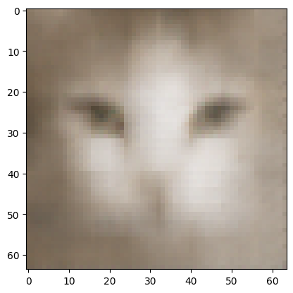
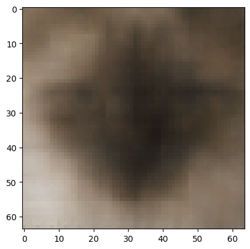

# Gen-chats
Test de différents modèles de génération: AE-VAE-GAN-Diffusion

# ProjetIA: Génération d'images

Projet en cours 

Projet personnel réalisé avec PyTorch qui a pour but d'explorer et de comprendre les modèles génératifs, en commençant par un autoencodeur sur MNIST

## Objectifs

## Technologies

- Python
- Pytorch
- torchvision
- Matplotlib
- NumPy

## AutoEncodeurs 

x -> encoder -> z -> decoder

Marche peu/pas pour générer des images, fait attendu. L'espace latent n'a aucune raison d'être ordonnée et cohérent, mais il marche très bien en temps qu'auto-encodeur et même pour débruiter des images.
J'ai quand même testé de générer une image, puis de la faire passer dans l'auto-encodeur (puisqu'on a vu qu'il débruitait très bien) mais peu concluant: l'image généré n'est donc ni de près ni de loin apparenté à un chiffre.

## VAE

On ordonne l'espace latent. 

Pour ce faire au lieu de faire x -> encoder -> z -> decoder, on fait:
x -> encoder -> mu(x), sigma(x) -> z = mu(x) + sigma(x)epsilon -> decoder

Donc déjà pendant l'entrainement, un même chiffre ne fournit pas exactement le même z, et donc ça force le decoder à apprendre à décoder une distribution plutot qu'un chiffre précis.

Mais ça ne suffit pas, parceque on pourrait avoir des zones très eparses: la distribution des 7 et des 5, par exemple, pourrait être très très éloignée.

D'où la necessité d'introduire une KL loss qui va en gros forcer les distribution à s'approcher d'une loi normale centrée en 0.

Commence alors un subtil jeu: si la KL loss est trop faible, un 5 et un 7 donnent une distribution similaire dans l'espace latent (la distribution normale centrée en 0) et on perd tout l'information. Mais si la KL loss est trop haute, les distributions sont trop éparses et un point aléatoire a aucune raison de se trouver dans une distribution de chat.

Le premier VAE a un espace latent de 64 dimensions, pour un total de 837 763 paramètres 

Les premiers chats sont très moyens et très flous:

Même en changeant le beta (la pondération devant la KL loss) mes chats sont toujours flous.

Problèmes possible:

- Mauvais dimensionnement de l'espace latent -> test de 8, 24 et 64: chats toujours aussi flous

- LOSS pas adapter: j'utilise une MSELoss (erreurs au carré): mes chats sont toujours aussi flou avec une L1Loss

-